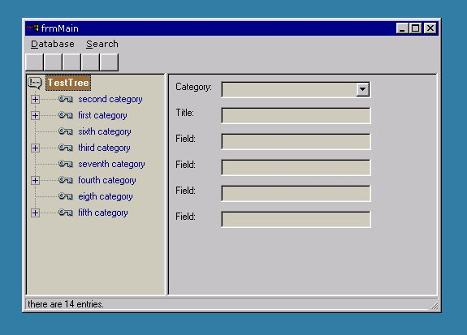



## Advanced Ado Database

### Description

Load your categorys in a treeview, create new entries under your personal categorys.

Three (!) completely different kinds of searching will help you finding any entrie you

are looking for.

You can create new categorys, delete or modify them. Learn how to create a better

database for contacts, source code or whatever.

The Treeview is resizeable ! easy by draging it to the left or right!

The sample application is 90% done, fully functionally and kept without a personal note

for a simple demo. (means no pics and icons you are deleting anyway )

You can easily change everything for your own needs. The database is

MS Access 97 Format. (You can upgrade to MS Access 2000 without changing any code. )
 
### More Info
 

             |
---                |---
**Submitted On**   |2002-12-03 12:05:28
**By**             |[Ranma Saotome](https://github.com/Planet-Source-Code/PSCIndex/blob/master/ByAuthor/ranma-saotome.md)
**Level**          |Advanced
**User Rating**    |4.7 (28 globes from 6 users)
**Compatibility**  |VB 5\.0, VB 6\.0, VBA MS Access
**Category**       |[Databases/ Data Access/ DAO/ ADO](https://github.com/Planet-Source-Code/PSCIndex/blob/master/ByCategory/databases-data-access-dao-ado__1-6.md)
**World**          |[Visual Basic](https://github.com/Planet-Source-Code/PSCIndex/blob/master/ByWorld/visual-basic.md)
**Archive File**   |[Advanced\_A1507151232002\.zip](https://github.com/Planet-Source-Code/ranma-saotome-advanced-ado-database__1-41269/archive/master.zip)

